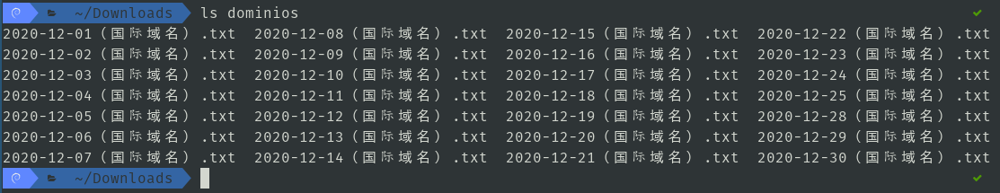
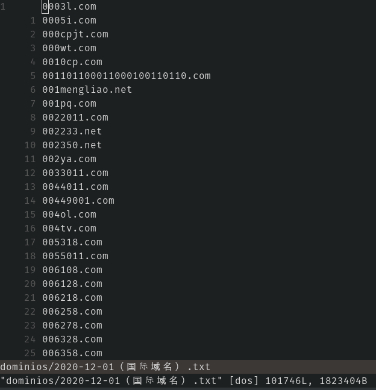

# Bash

## prueba2
## Descargar dominios muertos de diciembre del 2020
1. `codigo.sh`

	```bash
	#!/bin/bash
	#s="http://static.hupo.com/expdomain_myadmin/2020-02-21%EF%BC%88%E5%9B%BD%E9%99%85%E5%9F%9F%E5%90%8D%EF%BC%89.txt";
	a="http://static.hupo.com/expdomain_myadmin/2020-12-";
	b="%EF%BC%88%E5%9B%BD%E9%99%85%E5%9F%9F%E5%90%8D%EF%BC%89.txt";
	mkdir dominios
	cd dominios
	for i in {1..31}
	do
		if [ $i -lt 10 ]
		then
			wget $a'0'$i$b
		else
			wget $a$i$b
		fi
	done
	```
2. Archivos .txt descargados  
	  
3. Contenido de uno de los archivos .txt  
	  

