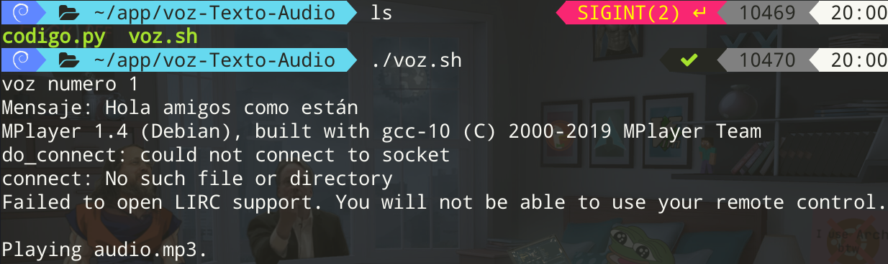

# Texto a audio enumerado: Una alternativa a loquendo

## Archivos necesarios

* `codigo.py`

	```py
	from gtts import gTTS
	import os
	text = input("Mensaje: ")
	tts = gTTS(text, lang='es')
	tts.save("audio.mp3")
	os.system("mplayer audio.mp3")
	```

* `voz.sh`

	```sh
	#!/bin/bash
	mkdir ~/Downloads/voz
	for i in {1..1000}
	do
		read -p "voz numero $i"
		python3 codigo.py
		mv audio.mp3 $i.mp3 
		mv $i.mp3 ~/Downloads/voz/
	done
	```

## Ejecución

```sh
$ ./voz.sh
```



## Output

* `~/Downloads/voz`

	```sh
	voz
	|__ 1.mp3
	|__ 2.mp3
	|__ 3.mp3
	|__ 4.mp3
	```
