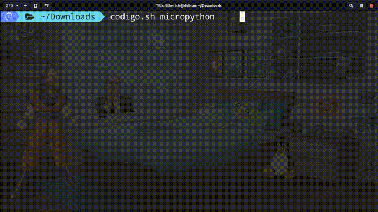

# Codigo: una forma fácil y rápida de inicializar código

## Preparar comando

1. `$ vim codigo.sh`

	```sh
	#!/bin/bash
	case $1 in
		"cpp") cp $HOME/.plantillas/lenguajes/cplusplus.cpp 		$PWD/codigo.cpp;;
		"md") cp $HOME/.plantillas/lenguajes/markdown.md 		$PWD/README.md;;
		"c") cp $HOME/.plantillas/lenguajes/c.c				$PWD/codigo.c;;
		"ino") cp $HOME/.plantillas/lenguajes/arduino.ino		$PWD/codigo.ino;;
		"html") cp $HOME/.plantillas/lenguajes/pagina.html		$PWD/index.html;;
		"css") cp $HOME/.plantillas/lenguajes/estilo.css		$PWD/estilo.css;;
		"js") cp $HOME/.plantillas/lenguajes/codigo.js			$PWD/codigo.js;;
		"java") cp $HOME/.plantillas/lenguajes/codigo.java		$PWD/codigo.java;;
		"tex") cp $HOME/.plantillas/lenguajes/codigo.tex		$PWD/codigo.tex;;
		"php") cp $HOME/.plantillas/lenguajes/codigo.php		$PWD/codigo.php;;
		"rs") cp $HOME/.plantillas/lenguajes/rust.rs			$PWD/codigo.rs;;
		"go") cp $HOME/.plantillas/lenguajes/golang.go			$PWD/codigo.go;;
		"cmake") 
			mkdir $PWD/build 
			cp $HOME/.plantillas/lenguajes/cplusplus.cpp 		$PWD/codigo.cpp
			cp $HOME/.plantillas/lenguajes/CMakeLists.txt		$PWD/CMakeLists.txt
			cmake -B $PWD/build
			make -C $PWD/build
			$PWD/build/ejecutable;;
		"micropython") 
			cp $HOME/.plantillas/lenguajes/micropython.py		$PWD/micropython.py
			ampy --port /dev/ttyACM1 run micropython.py;;
		"bluepill") 
			git clone --recurse-submodules https://github.com/libopencm3/libopencm3-template.git $PWD/stm32-proyecto
			make -C $PWD/stm32-proyecto/libopencm3
			cp -rf $HOME/.plantillas/lenguajes/stm32Bluepill.c		$PWD/stm32-proyecto/my-project/my-project.c
			cp -rf $HOME/.plantillas/lenguajes/stm32Bluepill/Makefile	$PWD/stm32-proyecto/my-project/Makefile
			make -C $PWD/stm32-proyecto/my-project
			st-flash --reset write $PWD/stm32-proyecto/my-project/blink-led.bin 0x8000000;;
		"tiny-go-arduino") 
			cp $HOME/.plantillas/lenguajes/tiny-go-arduino.go	$PWD/codigo.go
			tinygo flash -target arduino $PWD/codigo.go;;
		"ino-mk") 
			mkdir $PWD/blink
			ln -s /usr/share/arduino/Arduino.mk 			$PWD/blink
			cp $HOME/.plantillas/lenguajes/arduino-mk/Makefile	$PWD/blink/Makefile
			cp $HOME/.plantillas/lenguajes/arduino.ino		$PWD/blink/arduino.ino
			make -C $PWD/blink/
			make -C $PWD/blink/ upload;;
		"rp-hal") cp $HOME/.plantillas/lenguajes/rp-hal.rs		$PWD/rp-hal.rs;;
		"circuit") cp $HOME/.plantillas/lenguajes/CircuitPython.py	$PWD/CircuitPython.py;;
		"five") cp $HOME/.plantillas/lenguajes/JohnnyFive.js		$PWD/JohnnyFive.js;;
	esac
	```

2. Mover a la ruta adecuada

	```sh
	$ chmod +x codigo.sh
	$ sudo mv codigo.sh /usr/bin/
	```

3. `$ vim ~/.profile`

	```sh
	export PATH=/home/lilberick/.local/bin/codigo.sh/bin:$PATH
	```

## Ejemplos

* `$ codigo.sh cmake`

	

* `$ codigo.sh micropython`

	

* `$ codigo.sh bluepill`

	

* `$ codigo.sh tiny-go-arduino`

	

* `$ codigo.sh ino-mk`

	
